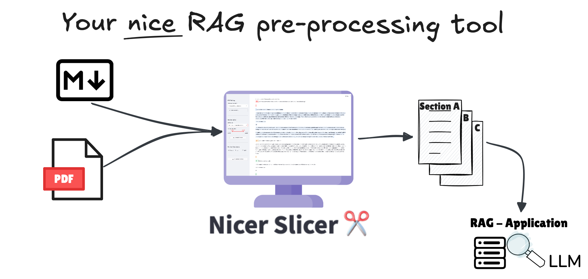

# Nicer Slicer ✂️
The Nicer Slicer app can be used to nicely slice your pdf document. The user has the ability to upload the document, which is processed by the `ds4sd/SmolDocling-256M-preview` VLLM and then can be sliced into fitting sections before generating chunks for your RAG tool. Alternatively the user can work with a custom markdown file.



### Screenshot of the Nicer Slicer application


## Run the app
Clone the repository before executing the following steps.
```bash
# Install requirements
pip install requirements.txt

# Install the nicerslicer package
pip install -e .

# Run the app
streamlit run NicerSclicer.py
```
